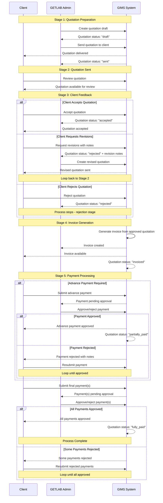

# GIMS Billing Lifecycle Documentation

This document provides visual diagrams to help understand the billing lifecycle process in the GIMS (Geotechnical Information Management System).

## Overview

The billing lifecycle consists of 5 main stages that guide projects from quotation creation to final payment completion. The system handles both advance payments and final payments, with support for revisions, rejections, and resubmissions.

## Mermaid Sequence Diagram



## ASCII Flow Diagram

```
┌─────────────────────────────────────────────────────────────────────────────────┐
│                           GIMS BILLING LIFECYCLE                                │
└─────────────────────────────────────────────────────────────────────────────────┘

STAGE 1: QUOTATION PREPARATION
┌─────────────────────────────────────────────────────────────────────────────────┐
│ GETLAB Admin creates quotation draft                                            │
│ ↓                                                                               │
│ Admin sends quotation to client                                                 │
│ ↓                                                                               │
│ Status: "draft" → "sent"                                                       │
└─────────────────────────────────────────────────────────────────────────────────┘
                                ↓
STAGE 2: QUOTATION SENT
┌─────────────────────────────────────────────────────────────────────────────────┐
│ Client receives quotation for review                                            │
│ ↓                                                                               │
│ Client can: View quotation, Accept, Request revisions, or Reject               │
└─────────────────────────────────────────────────────────────────────────────────┘
                                ↓
STAGE 3: CLIENT FEEDBACK
┌─────────────────────────────────────────────────────────────────────────────────┐
│                                                                                 │
│ ┌─────────────────┐  ┌─────────────────┐  ┌─────────────────┐                │
│ │   ACCEPT        │  │   REVISE        │  │   REJECT        │                │
│ │                 │  │                 │  │                 │                │
│ │ Status:         │  │ Status:         │  │ Status:         │                │
│ │ "accepted"      │  │ "rejected"      │  │ "rejected"      │                │
│ │                 │  │ + notes         │  │                 │                │
│ │ ↓               │  │                 │  │ ↓               │                │
│ │ Continue to     │  │ ↓               │  │ Process         │                │
│ │ Stage 4          │  │ Admin creates   │  │ STOPS           │                │
│ │                  │  │ revised         │  │                 │                │
│ │                  │  │ quotation       │  │                 │                │
│ │                  │  │                 │  │                 │                │
│ │                  │  │ ↓               │  │                 │                │
│ │                  │  │ Back to         │  │                 │                │
│ │                  │  │ Stage 2         │  │                 │                │
│ └─────────────────┘  └─────────────────┘  └─────────────────┘                │
└─────────────────────────────────────────────────────────────────────────────────┘
                                ↓
STAGE 4: INVOICE GENERATION
┌─────────────────────────────────────────────────────────────────────────────────┐
│ System generates invoice from approved quotation                               │
│ ↓                                                                               │
│ Invoice file created and available to both parties                             │
│ ↓                                                                               │
│ Status: "invoiced"                                                              │
└─────────────────────────────────────────────────────────────────────────────────┘
                                ↓
STAGE 5: PAYMENT PROCESSING
┌─────────────────────────────────────────────────────────────────────────────────┐
│                                                                                 │
│ ADVANCE PAYMENT (if required)                                                  │
│ ┌─────────────────────────────────────────────────────────────────────────────┐ │
│ │ Client submits advance payment                                              │ │
│ │ ↓                                                                           │ │
│ │ Admin reviews and approves/rejects                                          │ │
│ │ ↓                                                                           │ │
│ │ If rejected: Client resubmits until approved                                │ │
│ │ ↓                                                                           │ │
│ │ Status: "partially_paid"                                                    │ │
│ └─────────────────────────────────────────────────────────────────────────────┘ │
│                                                                                 │
│ FINAL PAYMENT(S)                                                                │
│ ┌─────────────────────────────────────────────────────────────────────────────┐ │
│ │ Client submits final payment(s)                                             │ │
│ │ ↓                                                                           │ │
│ │ Admin reviews and approves/rejects each payment                             │ │
│ │ ↓                                                                           │ │
│ │ If any rejected: Client resubmits until all approved                        │ │
│ │ ↓                                                                           │ │
│ │ Status: "fully_paid"                                                        │ │
│ └─────────────────────────────────────────────────────────────────────────────┘ │
└─────────────────────────────────────────────────────────────────────────────────┘

PAYMENT STATUSES:
┌─────────────────────────────────────────────────────────────────────────────────┐
│ • pending: Payment submitted, awaiting admin approval                          │
│ • approved: Payment approved by admin                                           │
│ • rejected: Payment rejected by admin (can be resubmitted)                      │
│                                                                                 │
│ PAYMENT TYPES:                                                                  │
│ • advance: Advance payment (if required by quotation)                          │
│ • full: Full payment covering entire amount                                    │
│ • other: Custom payment amount                                                  │
└─────────────────────────────────────────────────────────────────────────────────┘

QUOTATION STATUSES:
┌─────────────────────────────────────────────────────────────────────────────────┐
│ • draft: Quotation created but not sent                                        │
│ • sent: Quotation sent to client for review                                    │
│ • accepted: Client accepted the quotation                                      │
│ • rejected: Client rejected the quotation                                      │
│ • invoiced: Invoice generated from approved quotation                          │
│ • partially_paid: Some payments received and approved                          │
│ • fully_paid: All payments received and approved                               │
└─────────────────────────────────────────────────────────────────────────────────┘
```

## Key Features

### 1. **Role-Based Access**

- **Clients**: Can view quotations, respond with accept/reject/revision requests, and make payments
- **GETLAB Admins**: Can create quotations, send them, handle revisions, approve/reject payments

### 2. **Revision Support**

- Clients can request revisions with detailed notes
- Admins can create revised quotations
- System tracks revision history

### 3. **Payment Flexibility**

- Support for advance payments (percentage-based)
- Multiple payment submissions
- Payment resubmission after rejection
- Admin approval workflow for all payments

### 4. **Status Tracking**

- Real-time status updates
- Visual progress indicators
- Clear stage progression

### 5. **Error Handling**

- Rejection scenarios with clear messaging
- Resubmission workflows
- Process stops at rejection points

## Common Scenarios

### Scenario 1: Standard Flow

1. Admin creates quotation → sends to client
2. Client accepts quotation
3. Invoice generated
4. Client makes advance payment (if required) → approved
5. Client makes final payment → approved
6. Process complete

### Scenario 2: Revision Flow

1. Admin creates quotation → sends to client
2. Client requests revisions
3. Admin creates revised quotation → sends to client
4. Client accepts revised quotation
5. Continue with invoice and payment flow

### Scenario 3: Payment Rejection Flow

1. Client submits payment
2. Admin rejects payment with notes
3. Client resubmits payment
4. Admin approves resubmitted payment
5. Process continues

This visual documentation should help users understand the billing lifecycle process and navigate through the different stages and decision points.
