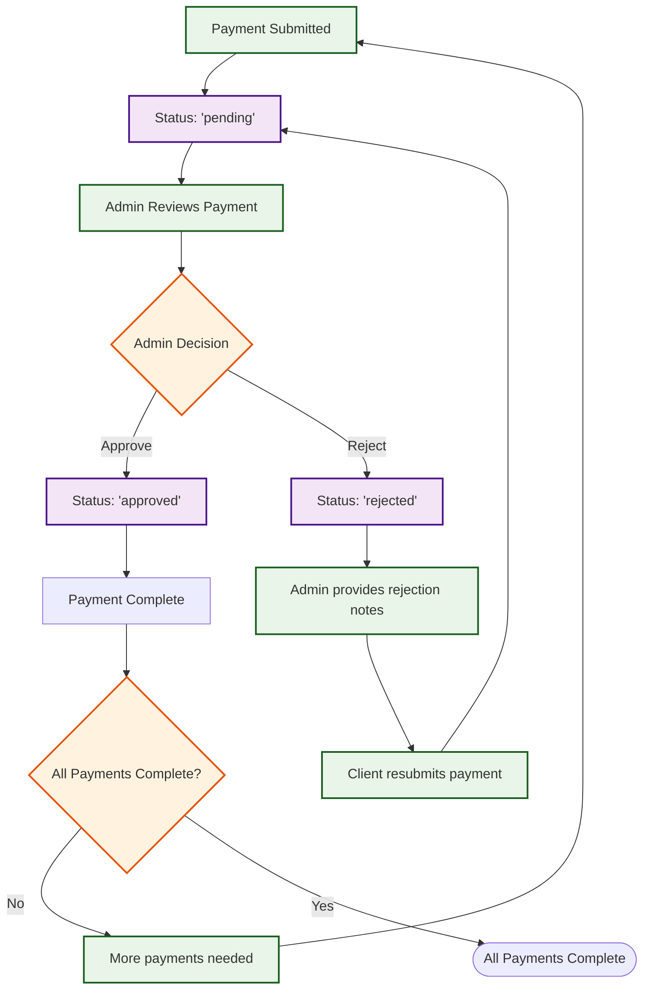
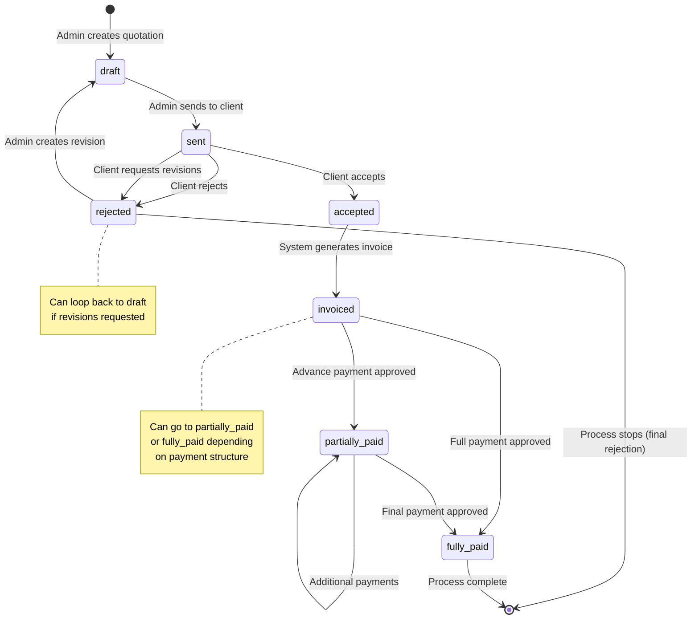

# GIMS Billing Lifecycle - Detailed Flowchart

## Mermaid Flowchart Diagram

```mermaid
flowchart TD
    Start([Project Created]) --> Stage1[Stage 1: Quotation Preparation]

    Stage1 --> CreateDraft[Admin creates quotation draft]
    CreateDraft --> DraftStatus[Status: 'draft']
    DraftStatus --> SendQuotation[Admin sends quotation to client]
    SendQuotation --> SentStatus[Status: 'sent']
    SentStatus --> Stage2[Stage 2: Quotation Sent]

    Stage2 --> ClientReview[Client reviews quotation]
    ClientReview --> Stage3[Stage 3: Client Feedback]

    Stage3 --> Decision{Client Decision}

    Decision -->|Accept| AcceptQuotation[Client accepts quotation]
    AcceptQuotation --> AcceptedStatus[Status: 'accepted']
    AcceptedStatus --> Stage4[Stage 4: Invoice Generation]

    Decision -->|Request Revisions| RequestRevision[Client requests revisions with notes]
    RequestRevision --> RejectedStatus[Status: 'rejected' + revision notes]
    RejectedStatus --> AdminRevise[Admin creates revised quotation]
    AdminRevise --> BackToStage2[Back to Stage 2]
    BackToStage2 --> Stage2

    Decision -->|Reject| RejectQuotation[Client rejects quotation]
    RejectQuotation --> RejectedFinal[Status: 'rejected']
    RejectedFinal --> ProcessStop[Process STOPS - Rejection Stage]

    Stage4 --> GenerateInvoice[System generates invoice]
    GenerateInvoice --> InvoiceStatus[Status: 'invoiced']
    InvoiceStatus --> Stage5[Stage 5: Payment Processing]

    Stage5 --> AdvanceCheck{Advance Payment Required?}

    AdvanceCheck -->|Yes| AdvancePayment[Client submits advance payment]
    AdvancePayment --> AdvancePending[Status: 'pending']
    AdvancePending --> AdvanceReview[Admin reviews advance payment]
    AdvanceReview --> AdvanceDecision{Advance Approved?}

    AdvanceDecision -->|Yes| AdvanceApproved[Advance payment approved]
    AdvanceApproved --> PartialStatus[Status: 'partially_paid']
    PartialStatus --> FinalPayments[Client submits final payment(s)]

    AdvanceDecision -->|No| AdvanceRejected[Advance payment rejected]
    AdvanceRejected --> AdvanceResubmit[Client resubmits advance payment]
    AdvanceResubmit --> AdvancePending

    AdvanceCheck -->|No| FinalPayments

    FinalPayments --> PaymentPending[Payment status: 'pending']
    PaymentPending --> PaymentReview[Admin reviews payment(s)]
    PaymentReview --> PaymentDecision{All Payments Approved?}

    PaymentDecision -->|Yes| AllApproved[All payments approved]
    AllApproved --> FullyPaid[Status: 'fully_paid']
    FullyPaid --> Complete([Process Complete])

    PaymentDecision -->|No| SomeRejected[Some payments rejected]
    SomeRejected --> PaymentResubmit[Client resubmits rejected payments]
    PaymentResubmit --> PaymentPending

    %% Styling
    classDef stageBox fill:#e1f5fe,stroke:#01579b,stroke-width:2px
    classDef decisionBox fill:#fff3e0,stroke:#e65100,stroke-width:2px
    classDef statusBox fill:#f3e5f5,stroke:#4a148c,stroke-width:2px
    classDef processBox fill:#e8f5e8,stroke:#1b5e20,stroke-width:2px
    classDef stopBox fill:#ffebee,stroke:#b71c1c,stroke-width:2px

    class Stage1,Stage2,Stage3,Stage4,Stage5 stageBox
    class Decision,AdvanceCheck,AdvanceDecision,PaymentDecision decisionBox
    class DraftStatus,SentStatus,AcceptedStatus,RejectedStatus,InvoiceStatus,PartialStatus,FullyPaid statusBox
    class CreateDraft,SendQuotation,ClientReview,AcceptQuotation,RequestRevision,AdminRevise,GenerateInvoice,AdvancePayment,FinalPayments,PaymentReview processBox
    class ProcessStop stopBox
```

## Payment Status Flowchart



## Quotation Status Transitions



## Key Decision Points

### 1. **Client Response to Quotation**

- **Accept**: Proceed to invoice generation
- **Request Revisions**: Loop back to quotation creation
- **Reject**: Stop the process

### 2. **Advance Payment Requirement**

- **Required**: Must be approved before final payments
- **Not Required**: Proceed directly to final payments

### 3. **Payment Approval**

- **Approved**: Payment accepted, continue process
- **Rejected**: Client must resubmit until approved

### 4. **Payment Completion**

- **All Approved**: Process complete
- **Some Rejected**: Continue resubmission loop

This detailed flowchart shows all the decision points, loops, and status transitions in the billing lifecycle, making it easier for users to understand the complete process flow.
