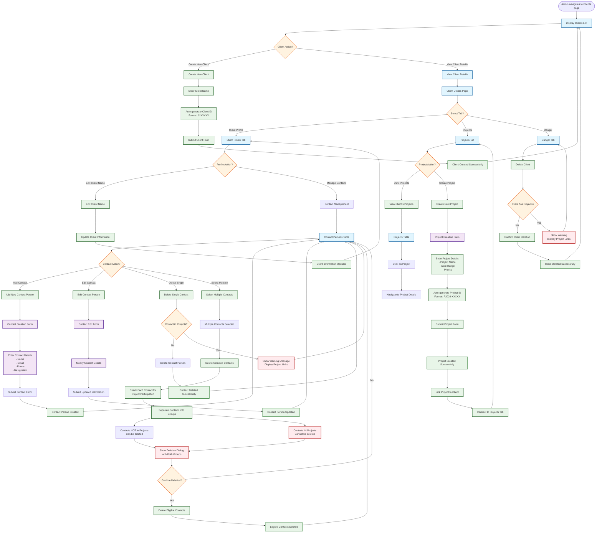

# GIMS Client Management - Detailed Flowchart

## Mermaid Flowchart Diagram

## Simplified Client Management Flow

```mermaid
flowchart LR
    subgraph "Client Creation"
        A[Create Client] --> B[Enter Client Name]
        B --> C[Auto-generate ID]
        C --> D[Client Created]
    end

    subgraph "Client Management"
        E[Edit Client Info] --> F[Update Client Name]
        F --> G[Client Updated]
    end

    subgraph "Contact Management"
        H[Add Contact] --> I[Enter Contact Details]
        I --> J[Contact Created]
        K[Edit Contact] --> L[Update Contact Info]
        L --> M[Contact Updated]
        N[Delete Contact] --> O{In Projects?}
        O -->|No| P[Contact Deleted]
        O -->|Yes| Q[Show Warning]
    end

    subgraph "Project Integration"
        R[View Projects] --> S[Client's Projects Table]
        T[Create Project] --> U[Enter Project Details]
        U --> V[Project Created]
        V --> W[Linked to Client]
    end

    D --> E
    G --> H
    J --> K
    M --> N
    P --> R
    Q --> R
    S --> T
    W --> S

    %% Styling
    classDef creationBox fill:#e3f2fd,stroke:#1976d2,stroke-width:2px
    classDef managementBox fill:#f3e5f5,stroke:#7b1fa2,stroke-width:2px
    classDef contactBox fill:#e8f5e8,stroke:#388e3c,stroke-width:2px
    classDef projectBox fill:#fff3e0,stroke:#f57c00,stroke-width:2px

    class A,B,C,D creationBox
    class E,F,G managementBox
    class H,I,J,K,L,M,N,O,P,Q contactBox
    class R,S,T,U,V,W projectBox
```

## Key Decision Points

### 1. **Contact Deletion Validation**

- **Single Contact**: Check if contact participates in any projects
- **Multiple Contacts**: Check each contact individually for project participation
- **Deletion Rules**: Only contacts not in projects can be deleted
- **Warning System**: Show project links for contacts that cannot be deleted

### 2. **Client-Project Relationship**

- **Project Creation**: Projects can be created directly from client page
- **Project Viewing**: All client's projects displayed in projects tab
- **Navigation**: Seamless movement between client and project pages
- **Dependency Check**: Client deletion blocked if projects exist

### 3. **Bulk Operations**

- **Multiple Selection**: Select multiple contacts from table
- **Batch Processing**: Process multiple contacts simultaneously
- **Selective Deletion**: Only delete contacts eligible for deletion
- **Clear Feedback**: Show which contacts can/cannot be deleted

### 4. **Data Integrity**

- **Project Dependencies**: Track which projects use specific contacts
- **Deletion Prevention**: Prevent deletion of data in use
- **Warning Messages**: Clear communication about deletion restrictions
- **Project Links**: Direct links to projects using specific contacts

## Contact Person Management Details

### **Add Contact Person**

- Click "Add Contact Person" button
- Fill in contact details form
- Submit form to create contact
- Contact automatically linked to client

### **Edit Contact Person**

- Click edit button on contact row
- Modify contact information in dialog
- Submit updated information
- Contact record updated in database

### **Delete Single Contact**

- Click delete button on contact row
- System checks project participation
- If not in projects: Delete contact
- If in projects: Show warning with project links

### **Delete Multiple Contacts**

- Select multiple contacts using checkboxes
- Click "Delete Selected" button
- System checks each contact for project participation
- Show dialog with two groups:
  - Contacts that can be deleted
  - Contacts that cannot be deleted (with project links)
- Confirm deletion of eligible contacts only

## Project Integration Details

### **View Client's Projects**

- Navigate to Projects tab
- View all projects associated with client
- Click on project to view details
- Direct navigation to project pages

### **Create Project for Client**

- Click "Create New Project" button
- Fill in project details form
- System auto-generates project ID
- Project created and linked to client
- Redirect to updated projects list

This flowchart provides a comprehensive visual representation of the client management lifecycle, focusing on the main operational flows and decision points without over-emphasizing technical implementation details.
