# GIMS Client Management Lifecycle Documentation

This document provides visual diagrams to help understand the client management lifecycle process in the GIMS (Geotechnical Information Management System).

## Overview

The client management lifecycle consists of 4 main stages that guide users through client creation, information management, contact person administration, and project integration. The system handles client creation, editing, contact person management with bulk operations, and direct project creation from client pages.

## Mermaid Sequence Diagram

```mermaid
sequenceDiagram
    participant Admin as GETLAB Admin
    participant System as GIMS System
    participant Client as Client Page
    participant Projects as Project System

    Note over Admin,Projects: Stage 1: Client Creation
    Admin->>Client: Navigate to Clients page
    Client-->>Admin: Display clients list
    Admin->>Client: Click "Add New Client"
    Client-->>Admin: Display client creation form
    Admin->>Client: Enter client name
    System-->>Admin: Auto-generate Client ID (C-XXXXX)
    Admin->>Client: Submit client form
    System->>System: Create client record
    System-->>Admin: Client created successfully
    System-->>Admin: Redirect to clients list

    Note over Admin,Projects: Stage 2: Client Information Management
    Admin->>Client: Navigate to client details
    Client-->>Admin: Display client profile tab
    Admin->>Client: Edit client name
    System->>System: Update client information
    System-->>Admin: Client information updated

    Note over Admin,Projects: Stage 3: Contact Person Management
    Admin->>Client: Navigate to contact persons section
    Client-->>Admin: Display contact persons table

    alt Add New Contact Person
        Admin->>Client: Click "Add Contact Person"
        Client-->>Admin: Display contact creation dialog
        Admin->>Client: Enter contact details (name, email, phone, designation)
        Admin->>Client: Submit contact form
        System->>System: Create contact person record
        System->>System: Link contact to client
        System-->>Admin: Contact person added successfully
    end

    alt Edit Contact Person
        Admin->>Client: Click edit button on contact row
        Client-->>Admin: Display contact edit dialog
        Admin->>Client: Modify contact details
        Admin->>Client: Submit updated information
        System->>System: Update contact person record
        System-->>Admin: Contact person updated successfully
    end

    alt Delete Single Contact Person
        Admin->>Client: Click delete button on contact row
        System->>System: Check if contact participates in projects
        alt Contact Not in Projects
            System->>System: Delete contact person record
            System-->>Admin: Contact person deleted successfully
        else Contact in Projects
            System-->>Admin: Show warning - cannot delete
            System-->>Admin: Display projects using this contact
        end
    end

    alt Delete Multiple Contact Persons
        Admin->>Client: Select multiple contacts from table
        Admin->>Client: Click "Delete Selected"
        System->>System: Check each contact for project participation
        System->>System: Separate contacts into two groups
        System-->>Admin: Show deletion dialog with:
        System-->>Admin: - Contacts that can be deleted
        System-->>Admin: - Contacts that cannot be deleted (with project links)
        Admin->>Client: Confirm deletion of eligible contacts
        System->>System: Delete contacts not in projects
        System-->>Admin: Eligible contacts deleted successfully
    end

    Note over Admin,Projects: Stage 4: Project Integration
    Admin->>Client: Navigate to Projects tab
    Client-->>Admin: Display client's projects

    alt View Existing Projects
        Client-->>Admin: Show projects table with client's projects
        Admin->>Client: Click on project to view details
        System-->>Admin: Navigate to project details page
    end

    alt Create New Project for Client
        Admin->>Client: Click "Create New Project"
        Client-->>Admin: Display project creation form
        Admin->>Client: Enter project details (name, dates, priority)
        System-->>Admin: Auto-generate Project ID (P2024-XXXXX)
        Admin->>Client: Submit project form
        System->>System: Create project record
        System->>System: Link project to client
        System-->>Admin: Project created successfully
        System-->>Admin: Redirect to client's projects tab
    end
```



## ASCII Flow Diagram

```
┌─────────────────────────────────────────────────────────────────────────────────┐
│                           GIMS CLIENT MANAGEMENT LIFECYCLE                      │
└─────────────────────────────────────────────────────────────────────────────────┘

STAGE 1: CLIENT CREATION
┌─────────────────────────────────────────────────────────────────────────────────┐
│ Admin navigates to Clients page                                                │
│ ↓                                                                               │
│ System displays clients list                                                    │
│ ↓                                                                               │
│ Admin clicks "Add New Client"                                                   │
│ ↓                                                                               │
│ System displays client creation form                                            │
│ ↓                                                                               │
│ Admin enters client name                                                        │
│ ↓                                                                               │
│ System auto-generates Client ID (C-XXXXX)                                      │
│ ↓                                                                               │
│ Admin submits client form                                                       │
│ ↓                                                                               │
│ System creates client record                                                    │
│ ↓                                                                               │
│ Status: "Client created successfully"                                           │
└─────────────────────────────────────────────────────────────────────────────────┘
                                ↓
STAGE 2: CLIENT INFORMATION MANAGEMENT
┌─────────────────────────────────────────────────────────────────────────────────┐
│ Admin navigates to client details page                                          │
│ ↓                                                                               │
│ System displays client profile tab                                              │
│ ↓                                                                               │
│ Admin edits client name                                                         │
│ ↓                                                                               │
│ System updates client information                                               │
│ ↓                                                                               │
│ Status: "Client information updated"                                            │
└─────────────────────────────────────────────────────────────────────────────────┘
                                ↓
STAGE 3: CONTACT PERSON MANAGEMENT
┌─────────────────────────────────────────────────────────────────────────────────┐
│                                                                                 │
│ ADD CONTACT PERSON                                                              │
│ ┌─────────────────────────────────────────────────────────────────────────────┐ │
│ │ Admin clicks "Add Contact Person"                                           │ │
│ │ ↓                                                                           │ │
│ │ System displays contact creation dialog                                     │ │
│ │ ↓                                                                           │ │
│ │ Admin enters contact details (name, email, phone, designation)             │ │
│ │ ↓                                                                           │ │
│ │ Admin submits contact form                                                  │ │
│ │ ↓                                                                           │ │
│ │ System creates contact person record                                        │ │
│ │ ↓                                                                           │ │
│ │ System links contact to client                                              │ │
│ │ ↓                                                                           │ │
│ │ Status: "Contact person added successfully"                                │ │
│ └─────────────────────────────────────────────────────────────────────────────┘ │
│                                                                                 │
│ EDIT CONTACT PERSON                                                             │
│ ┌─────────────────────────────────────────────────────────────────────────────┐ │
│ │ Admin clicks edit button on contact row                                     │ │
│ │ ↓                                                                           │ │
│ │ System displays contact edit dialog                                          │ │
│ │ ↓                                                                           │ │
│ │ Admin modifies contact details                                              │ │
│ │ ↓                                                                           │ │
│ │ Admin submits updated information                                           │ │
│ │ ↓                                                                           │ │
│ │ System updates contact person record                                        │ │
│ │ ↓                                                                           │ │
│ │ Status: "Contact person updated successfully"                               │ │
│ └─────────────────────────────────────────────────────────────────────────────┘ │
│                                                                                 │
│ DELETE CONTACT PERSON(S)                                                        │
│ ┌─────────────────────────────────────────────────────────────────────────────┐ │
│ │                                                                             │ │
│ │ SINGLE CONTACT DELETION                                                     │ │
│ │ ┌─────────────────────────────────────────────────────────────────────────┐ │ │
│ │ │ Admin clicks delete button on contact row                               │ │ │
│ │ │ ↓                                                                       │ │ │
│ │ │ System checks if contact participates in projects                       │ │ │
│ │ │ ↓                                                                       │ │ │
│ │ │ If NOT in projects: Delete contact person record                        │ │ │
│ │ │ If IN projects: Show warning with project links                         │ │ │
│ │ └─────────────────────────────────────────────────────────────────────────┘ │ │
│ │                                                                             │ │
│ │ MULTIPLE CONTACT DELETION                                                   │ │
│ │ ┌─────────────────────────────────────────────────────────────────────────┐ │ │
│ │ │ Admin selects multiple contacts from table                              │ │ │
│ │ │ ↓                                                                       │ │ │
│ │ │ Admin clicks "Delete Selected"                                          │ │ │
│ │ │ ↓                                                                       │ │ │
│ │ │ System checks each contact for project participation                    │ │ │
│ │ │ ↓                                                                       │ │ │
│ │ │ System separates contacts into two groups:                              │ │ │
│ │ │ - Contacts that can be deleted (not in projects)                        │ │ │
│ │ │ - Contacts that cannot be deleted (in projects)                        │ │ │
│ │ │ ↓                                                                       │ │ │
│ │ │ System displays deletion dialog with both groups                       │ │ │
│ │ │ ↓                                                                       │ │ │
│ │ │ Admin confirms deletion of eligible contacts                            │ │ │
│ │ │ ↓                                                                       │ │ │
│ │ │ System deletes contacts not in projects                                 │ │ │
│ │ │ ↓                                                                       │ │ │
│ │ │ Status: "Eligible contacts deleted successfully"                       │ │ │
│ │ └─────────────────────────────────────────────────────────────────────────┘ │ │
│ └─────────────────────────────────────────────────────────────────────────────┘ │
└─────────────────────────────────────────────────────────────────────────────────┘
                                ↓
STAGE 4: PROJECT INTEGRATION
┌─────────────────────────────────────────────────────────────────────────────────┐
│ Admin navigates to Projects tab                                                 │
│ ↓                                                                               │
│ System displays client's projects                                               │
│ ↓                                                                               │
│                                                                                 │
│ ┌─────────────────────────────────────────────────────────────────────────────┐ │
│ │ VIEW EXISTING PROJECTS                                                     │ │
│ │ ┌─────────────────────────────────────────────────────────────────────────┐ │ │
│ │ │ System shows projects table with client's projects                     │ │ │
│ │ │ ↓                                                                       │ │ │
│ │ │ Admin clicks on project to view details                                 │ │ │
│ │ │ ↓                                                                       │ │ │
│ │ │ System navigates to project details page                                │ │ │
│ │ └─────────────────────────────────────────────────────────────────────────┘ │ │
│ └─────────────────────────────────────────────────────────────────────────────┘ │
│                                                                                 │
│ ┌─────────────────────────────────────────────────────────────────────────────┐ │
│ │ CREATE NEW PROJECT FOR CLIENT                                              │ │
│ │ ┌─────────────────────────────────────────────────────────────────────────┐ │ │
│ │ │ Admin clicks "Create New Project"                                       │ │ │
│ │ │ ↓                                                                       │ │ │
│ │ │ System displays project creation form                                   │ │ │
│ │ │ ↓                                                                       │ │ │
│ │ │ Admin enters project details (name, dates, priority)                   │ │ │
│ │ │ ↓                                                                       │ │ │
│ │ │ System auto-generates Project ID (P2024-XXXXX)                         │ │ │
│ │ │ ↓                                                                       │ │ │
│ │ │ Admin submits project form                                              │ │ │
│ │ │ ↓                                                                       │ │ │
│ │ │ System creates project record                                           │ │ │
│ │ │ ↓                                                                       │ │ │
│ │ │ System links project to client                                          │ │ │
│ │ │ ↓                                                                       │ │ │
│ │ │ Status: "Project created successfully"                                  │ │ │
│ │ │ ↓                                                                       │ │ │
│ │ │ System redirects to client's projects tab                                │ │ │
│ │ └─────────────────────────────────────────────────────────────────────────┘ │ │
│ └─────────────────────────────────────────────────────────────────────────────┘ │
└─────────────────────────────────────────────────────────────────────────────────┘

CONTACT PERSON STATUSES:
┌─────────────────────────────────────────────────────────────────────────────────┐
│ • available: Contact person not linked to any projects (can be deleted)        │
│ • in_use: Contact person linked to one or more projects (cannot be deleted)    │
│                                                                                 │
│ DELETION RULES:                                                                 │
│ • Single deletion: Only contacts not in projects can be deleted                │
│ • Multiple deletion: Only contacts not in projects are deleted                 │
│ • Project dependency: Contacts in projects show warning with project links     │
└─────────────────────────────────────────────────────────────────────────────────┘

CLIENT-PROJECT RELATIONSHIPS:
┌─────────────────────────────────────────────────────────────────────────────────┐
│ • One-to-Many: One client can have multiple projects                            │
│ • Direct Creation: Projects can be created directly from client page            │
│ • Project Viewing: Client page shows all associated projects                    │
│ • Navigation: Direct links between client and project pages                     │
└─────────────────────────────────────────────────────────────────────────────────┘
```

## Key Features

### 1. **Client Lifecycle Management**

- **Creation**: Simple client creation with auto-generated IDs
- **Information Updates**: Easy client name editing
- **Profile Management**: Centralized client information storage

### 2. **Contact Person Administration**

- **Add Contacts**: Create new contact persons with full details
- **Edit Contacts**: Update existing contact information
- **Bulk Operations**: Select and delete multiple contacts
- **Project Dependency Check**: Automatic validation for deletion eligibility

### 3. **Project Integration**

- **Direct Project Creation**: Create projects from client page
- **Project Viewing**: View all client's projects in one place
- **Seamless Navigation**: Easy movement between client and project pages

### 4. **Data Integrity Protection**

- **Deletion Validation**: Prevents deletion of contacts used in projects
- **Project Dependency Tracking**: Shows which projects use specific contacts
- **Warning System**: Clear messaging for deletion restrictions

### 5. **User Experience Features**

- **Auto-Generated IDs**: Automatic ID generation for clients and projects
- **Responsive Design**: Works on desktop and mobile devices
- **Real-time Updates**: Immediate feedback for all operations
- **Bulk Selection**: Efficient management of multiple contacts

## Common Scenarios

### Scenario 1: Complete Client Setup

1. Admin creates new client → enters client name
2. Admin adds contact persons → enters contact details
3. Admin creates project for client → enters project details
4. Client is fully set up with contacts and projects

### Scenario 2: Contact Person Management

1. Admin views client's contact persons
2. Admin adds new contact person → enters details
3. Admin edits existing contact → updates information
4. Admin selects multiple contacts → deletes eligible ones
5. System shows warnings for contacts in projects

### Scenario 3: Project Management from Client Page

1. Admin navigates to client's projects tab
2. Admin views existing projects → clicks to view details
3. Admin creates new project → enters project information
4. System creates project and links to client
5. Admin is redirected to updated projects list

This visual documentation provides a comprehensive understanding of the client management lifecycle, focusing on the main operational flows without over-emphasizing technical implementation details.
