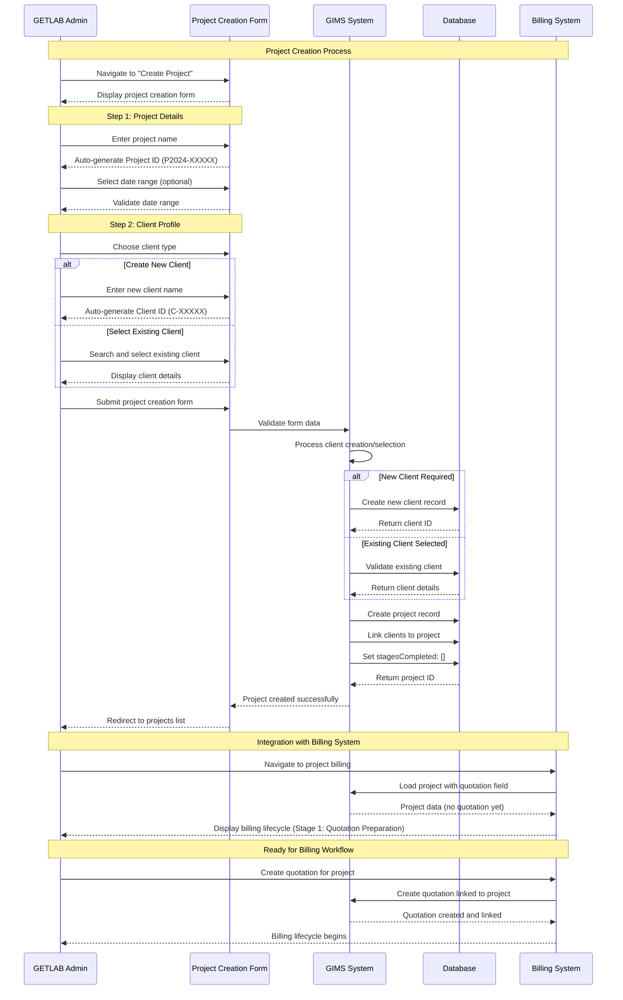

# GIMS Project Creation Process Documentation

This document provides visual diagrams to help understand the project creation process in the GIMS (Geotechnical Information Management System) and how it integrates with the billing workflow.

## Overview

The project creation process consists of 2 main steps that guide users through creating a new project with client information. Once created, projects serve as the foundation for the billing lifecycle, enabling quotation creation and payment processing.

## Mermaid Sequence Diagram



## ASCII Flow Diagram

```
┌─────────────────────────────────────────────────────────────────────────────────┐
│                           GIMS PROJECT CREATION PROCESS                         │
└─────────────────────────────────────────────────────────────────────────────────┘

STEP 1: PROJECT DETAILS FORM
┌─────────────────────────────────────────────────────────────────────────────────┐
│                                                                                 │
│ ┌─────────────────────────────────────────────────────────────────────────────┐ │
│ │ Project ID Generation                                                       │ │
│ │ ┌─────────────────────────────────────────────────────────────────────────┐ │ │
│ │ │ Auto-generated: P2024-XXXXX                                            │ │ │
│ │ │ Format: P + Year + Random 5-digit number                              │ │ │
│ │ │ Example: P2024-12345                                                   │ │ │
│ │ └─────────────────────────────────────────────────────────────────────────┘ │ │
│ └─────────────────────────────────────────────────────────────────────────────┘ │
│                                                                                 │
│ ┌─────────────────────────────────────────────────────────────────────────────┐ │
│ │ Project Name (Required)                                                     │ │
│ │ ┌─────────────────────────────────────────────────────────────────────────┐ │ │
│ │ │ User Input: "Nakawa Power Lines"                                        │ │ │
│ │ │ Validation: Required, trimmed, min 1 character                         │ │ │
│ │ └─────────────────────────────────────────────────────────────────────────┘ │ │
│ └─────────────────────────────────────────────────────────────────────────────┘ │
│                                                                                 │
│ ┌─────────────────────────────────────────────────────────────────────────────┐ │
│ │ Date Range (Optional)                                                       │ │ │
│ │ ┌─────────────────────────────────────────────────────────────────────────┐ │ │
│ │ │ Start Date: [Calendar Picker]                                          │ │ │
│ │ │ End Date: [Calendar Picker]                                           │ │ │
│ │ │ Validation: If start selected, end required; End must be after start   │ │ │
│ │ └─────────────────────────────────────────────────────────────────────────┘ │ │
│ └─────────────────────────────────────────────────────────────────────────────┘ │
└─────────────────────────────────────────────────────────────────────────────────┘
                                ↓
STEP 2: CLIENT PROFILE FORM
┌─────────────────────────────────────────────────────────────────────────────────┐
│                                                                                 │
│ ┌─────────────────────────────────────────────────────────────────────────────┐ │
│ │ Client Type Selection                                                       │ │ │
│ │ ┌─────────────────────────────────────────────────────────────────────────┐ │ │
│ │ │ ┌─────────────────────┐  ┌─────────────────────┐                      │ │ │
│ │ │ │   CREATE NEW CLIENT  │  │  CHOOSE EXISTING    │                      │ │ │
│ │ │ │                     │  │                     │                      │ │ │
│ │ │ │ Icon: UserPlus      │  │ Icon: Briefcase     │                      │ │ │
│ │ │ │                     │  │                     │                      │ │ │
│ │ │ │ ↓                   │  │ ↓                   │                      │ │ │
│ │ │ │ New client form     │  │ Existing client     │                      │ │ │
│ │ │ │                     │  │ selection dropdown  │                      │ │ │
│ │ │ └─────────────────────┘  └─────────────────────┘                      │ │ │
│ │ └─────────────────────────────────────────────────────────────────────────┘ │ │
│ └─────────────────────────────────────────────────────────────────────────────┘ │
│                                                                                 │
│ ┌─────────────────────────────────────────────────────────────────────────────┐ │
│ │ New Client Creation                                                         │ │ │
│ │ ┌─────────────────────────────────────────────────────────────────────────┐ │ │
│ │ │ Client ID: C-XXXXX (Auto-generated)                                     │ │ │
│ │ │ Client Name: "Acme Corporation" (Required)                              │ │ │
│ │ │ Validation: Required, trimmed, min 1 character                          │ │ │
│ │ └─────────────────────────────────────────────────────────────────────────┘ │ │
│ └─────────────────────────────────────────────────────────────────────────────┘ │
│                                                                                 │
│ ┌─────────────────────────────────────────────────────────────────────────────┐ │
│ │ Existing Client Selection                                                  │ │ │
│ │ ┌─────────────────────────────────────────────────────────────────────────┐ │ │
│ │ │ Searchable dropdown with all existing clients                          │ │ │
│ │ │ Display: Client name, validation: Must select existing client          │ │ │
│ │ └─────────────────────────────────────────────────────────────────────────┘ │ │
│ └─────────────────────────────────────────────────────────────────────────────┘ │
└─────────────────────────────────────────────────────────────────────────────────┘
                                ↓
FORM SUBMISSION & VALIDATION
┌─────────────────────────────────────────────────────────────────────────────────┐
│                                                                                 │
│ ┌─────────────────────────────────────────────────────────────────────────────┐ │
│ │ Client-Side Validation                                                      │ │ │
│ │ ┌─────────────────────────────────────────────────────────────────────────┐ │ │
│ │ │ ✓ Project name required                                                 │ │ │
│ │ │ ✓ At least one client required                                          │ │ │
│ │ │ ✓ New client name required (if new client selected)                     │ │ │
│ │ │ ✓ Existing client selection required (if existing selected)           │ │ │
│ │ │ ✓ Date range validation (if dates provided)                           │ │ │
│ │ └─────────────────────────────────────────────────────────────────────────┘ │ │
│ └─────────────────────────────────────────────────────────────────────────────┘ │
│                                                                                 │
│ ┌─────────────────────────────────────────────────────────────────────────────┐ │
│ │ Server-Side Processing                                                      │ │ │
│ │ ┌─────────────────────────────────────────────────────────────────────────┐ │ │
│ │ │ 1. Create new client (if new client selected)                           │ │ │
│ │ │ 2. Validate existing client (if existing selected)                     │ │ │
│ │ │ 3. Create project record with:                                         │ │ │
│ │ │    - Project name, ID, dates, priority                                 │ │ │
│ │ │    - Client references                                                  │ │ │
│ │ │    - stagesCompleted: ["BILLING"]                                      │ │ │
│ │ │ 4. Link clients to project                                             │ │ │
│ │ └─────────────────────────────────────────────────────────────────────────┘ │ │
│ └─────────────────────────────────────────────────────────────────────────────┘ │
└─────────────────────────────────────────────────────────────────────────────────┘
                                ↓
INTEGRATION WITH BILLING SYSTEM
┌─────────────────────────────────────────────────────────────────────────────────┐
│                                                                                 │
│ ┌─────────────────────────────────────────────────────────────────────────────┐ │
│ │ Project → Billing Integration                                               │ │ │
│ │ ┌─────────────────────────────────────────────────────────────────────────┐ │ │
│ │ │ Project Created Successfully                                            │ │ │
│ │ │ ↓                                                                       │ │ │
│ │ │ Redirect to Projects List                                               │ │ │
│ │ │ ↓                                                                       │ │ │
│ │ │ User navigates to project billing                                       │ │ │
│ │ │ ↓                                                                       │ │ │
│ │ │ Billing System loads project data                                       │ │ │
│ │ │ ↓                                                                       │ │ │
│ │ │ Check quotation field: null (no quotation yet)                         │ │ │
│ │ │ ↓                                                                       │ │ │
│ │ │ Display Billing Lifecycle Stage 1:                                      │ │ │
│ │ │ "Quotation Preparation"                                                 │ │ │
│ │ │ ↓                                                                       │ │ │
│ │ │ Ready for quotation creation                                             │ │ │
│ │ └─────────────────────────────────────────────────────────────────────────┘ │ │
│ └─────────────────────────────────────────────────────────────────────────────┘ │
│                                                                                 │
│ ┌─────────────────────────────────────────────────────────────────────────────┐ │
│ │ Billing Workflow Entry Point                                               │ │ │
│ │ ┌─────────────────────────────────────────────────────────────────────────┐ │ │
│ │ │ Admin can now:                                                         │ │ │
│ │ │ • Create quotation for the project                                     │ │ │
│ │ │ • Select lab tests and field tests                                     │ │ │
│ │ │ • Add mobilization and reporting activities                            │ │ │
│ │ │ • Generate quotation document                                          │ │ │
│ │ │ • Send quotation to client                                             │ │ │
│ │ │ • Begin billing lifecycle process                                      │ │ │
│ │ └─────────────────────────────────────────────────────────────────────────┘ │ │
│ └─────────────────────────────────────────────────────────────────────────────┘ │
└─────────────────────────────────────────────────────────────────────────────────┘

PROJECT SCHEMA STRUCTURE:
┌─────────────────────────────────────────────────────────────────────────────────┐
│ Project Document Fields:                                                       │
│ • internalId: "P2024-12345" (unique identifier)                               │
│ • name: "Nakawa Power Lines" (project name)                                   │
│ • priority: "high" | "medium" | "low" | "urgent" | "noPriority"              │
│ • startDate: ISO datetime (optional)                                          │
│ • endDate: ISO datetime (optional)                                             │
│ • clients: [array of client references]                                        │
│ • contactPersons: [array of contact person references]                        │
│ • projectPersonnel: [array of personnel references]                          │
│ • projectSupervisors: [array of supervisor references]                       │
│ • stagesCompleted: [] (empty array initially)                                   │
│ • quotation: reference to quotation document (initially null)               │
└─────────────────────────────────────────────────────────────────────────────────┘

CLIENT SCHEMA STRUCTURE:
┌─────────────────────────────────────────────────────────────────────────────────┐
│ Client Document Fields:                                                        │
│ • _id: auto-generated unique ID                                               │
│ • name: "Acme Corporation" (client name)                                      │
│ • internalId: "C-12345" (auto-generated)                                      │
│ • contactPersons: [array of contact person references]                        │
│ • projects: [array of project references]                                      │
└─────────────────────────────────────────────────────────────────────────────────┘
```

## Key Features

### 1. **Auto-Generated IDs**

- **Project ID**: Format `P{Year}-{5-digit-random}` (e.g., P2024-12345)
- **Client ID**: Format `C-{5-digit-random}` (e.g., C-12345)
- **Unique**: System ensures no duplicate IDs

### 2. **Flexible Client Management**

- **New Client**: Create client during project creation
- **Existing Client**: Select from existing client database
- **Multiple Clients**: Support for multiple clients per project (UI disabled but schema supports it)

### 3. **Form Validation**

- **Client-side**: Real-time validation with react-hook-form
- **Server-side**: Zod schema validation
- **Required Fields**: Project name, at least one client
- **Optional Fields**: Date range, priority

### 4. **Billing Integration**

- **Seamless Transition**: Projects automatically ready for billing
- **Quotation Field**: Initially null, populated when quotation created
- **Stage Tracking**: `stagesCompleted` array tracks billing progress
- **Lifecycle Entry**: Projects serve as entry point to billing workflow

## Integration Points with Billing

### 1. **Project → Quotation Relationship**

```
Project Document
├── quotation: null (initially)
└── stagesCompleted: []

After Quotation Creation:
Project Document
├── quotation: reference to quotation document
└── stagesCompleted: ["QUOTATION_CREATED", "QUOTATION_SENT", ...]
```

### 2. **Billing Lifecycle Entry**

- Projects without quotations show "Quotation Preparation" stage
- Admin can create quotations directly from project view
- Quotation creation populates the `quotation` field in project
- Billing lifecycle begins with quotation creation

### 3. **Data Flow**

```
Project Creation → Database → Billing System → Quotation Creation → Payment Processing
```

This visual documentation should help users understand the project creation process and how it seamlessly integrates with the billing workflow, making it easier to navigate from project setup to quotation and payment management.
