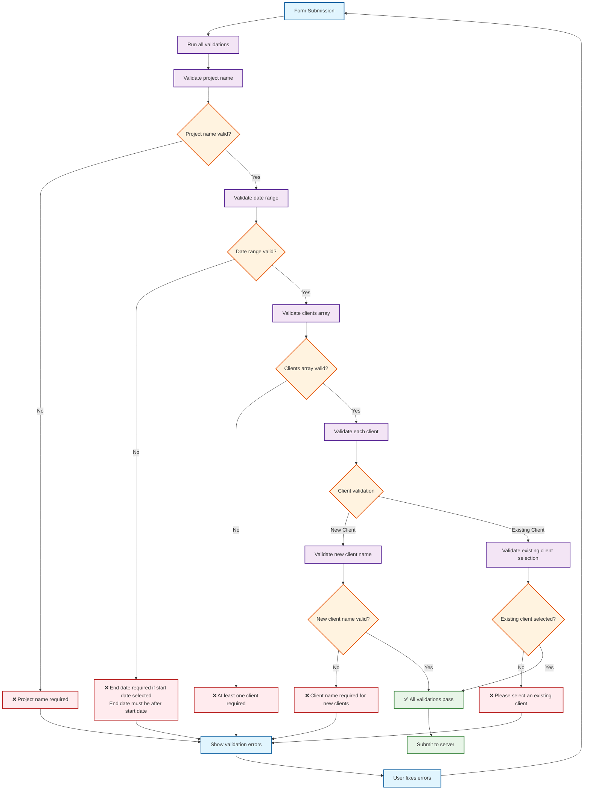

# GIMS Project Creation - Detailed Flowchart

## Mermaid Flowchart Diagram

```mermaid
flowchart TD
    Start([User clicks "Create Project"]) --> LoadForm[Load Project Creation Form]

    LoadForm --> Step1[Step 1: Project Details Form]

    Step1 --> GenerateProjectID[Auto-generate Project ID<br/>Format: P2024-XXXXX]
    GenerateProjectID --> ProjectName[User enters project name]

    ProjectName --> ValidateProjectName{Project name valid?}
    ValidateProjectName -->|No| ProjectNameError[Show validation error]
    ProjectNameError --> ProjectName

    ValidateProjectName -->|Yes| DateRange[User selects date range<br/>(Optional)]

    DateRange --> ValidateDates{Date range valid?}
    ValidateDates -->|No| DateError[Show date validation error]
    DateError --> DateRange

    ValidateDates -->|Yes| Step2[Step 2: Client Profile Form]

    Step2 --> ClientType{Client Type Selection}

    ClientType -->|Create New Client| NewClientForm[New Client Form]
    ClientType -->|Choose Existing| ExistingClientForm[Existing Client Form]

    NewClientForm --> GenerateClientID[Auto-generate Client ID<br/>Format: C-XXXXX]
    GenerateClientID --> ClientName[User enters client name]

    ClientName --> ValidateNewClient{New client name valid?}
    ValidateNewClient -->|No| NewClientError[Show validation error]
    NewClientError --> ClientName

    ValidateNewClient -->|Yes| ReadyToSubmit[Form ready for submission]

    ExistingClientForm --> ClientSearch[User searches existing clients]
    ClientSearch --> ClientSelection[User selects existing client]

    ClientSelection --> ValidateExistingClient{Existing client selected?}
    ValidateExistingClient -->|No| ExistingClientError[Show validation error]
    ExistingClientError --> ClientSelection

    ValidateExistingClient -->|Yes| ReadyToSubmit

    ReadyToSubmit --> SubmitForm[User submits form]

    SubmitForm --> ClientSideValidation{Client-side validation passes?}
    ClientSideValidation -->|No| ShowErrors[Show form errors]
    ShowErrors --> Step1

    ClientSideValidation -->|Yes| ServerProcessing[Server processes form data]

    ServerProcessing --> ProcessClients[Process client data]

    ProcessClients --> ClientTypeCheck{Client type?}

    ClientTypeCheck -->|New Client| CreateNewClient[Create new client in database]
    ClientTypeCheck -->|Existing Client| ValidateExisting[Validate existing client]

    CreateNewClient --> ClientCreated[Client created successfully]
    ValidateExisting --> ClientValidated[Client validated successfully]

    ClientCreated --> CreateProject[Create project record]
    ClientValidated --> CreateProject

    CreateProject --> LinkClients[Link clients to project]
    LinkClients --> SetStages[Set stagesCompleted: []]
    SetStages --> ProjectCreated[Project created successfully]

    ProjectCreated --> Redirect[Redirect to projects list]
    Redirect --> BillingIntegration[User navigates to billing]

    BillingIntegration --> LoadBilling[Load billing lifecycle]
    LoadBilling --> CheckQuotation{Quotation exists?}

    CheckQuotation -->|No| ShowStage1[Show Stage 1: Quotation Preparation]
    CheckQuotation -->|Yes| ShowCurrentStage[Show current billing stage]

    ShowStage1 --> ReadyForQuotation[Ready for quotation creation]
    ShowCurrentStage --> BillingWorkflow[Billing workflow continues]

    %% Styling
    classDef stepBox fill:#e1f5fe,stroke:#01579b,stroke-width:2px
    classDef decisionBox fill:#fff3e0,stroke:#e65100,stroke-width:2px
    classDef validationBox fill:#f3e5f5,stroke:#4a148c,stroke-width:2px
    classDef processBox fill:#e8f5e8,stroke:#1b5e20,stroke-width:2px
    classDef errorBox fill:#ffebee,stroke:#b71c1c,stroke-width:2px
    classDef successBox fill:#e8f5e8,stroke:#2e7d32,stroke-width:2px

    class Step1,Step2,LoadForm,GenerateProjectID,GenerateClientID,ClientName,ClientSearch,ClientSelection stepBox
    class ClientType,ValidateProjectName,ValidateDates,ValidateNewClient,ValidateExistingClient,ClientSideValidation,ClientTypeCheck,CheckQuotation decisionBox
    class ValidateClientSideValidation,ProcessClients,CreateProject,LinkClients,SetStages processBox
    class ProjectNameError,DateError,NewClientError,ExistingClientError,ShowErrors errorBox
    class ProjectCreated,ClientCreated,ClientValidated,ReadyToSubmit,ReadyForQuotation successBox
```

## Form Validation Flowchart



## Data Flow Diagram

```mermaid
flowchart LR
    subgraph "Frontend Form"
        A[Project Details Form] --> B[Client Profile Form]
        B --> C[Form Validation]
        C --> D[Form Submission]
    end

    subgraph "Backend Processing"
        E[Server Validation] --> F[Client Processing]
        F --> G[Project Creation]
        G --> H[Database Storage]
    end

    subgraph "Database"
        I[Client Collection] --> J[Project Collection]
        J --> K[Quotation Collection]
    end

    subgraph "Billing Integration"
        L[Billing Lifecycle] --> M[Quotation Creation]
        M --> N[Payment Processing]
    end

    D --> E
    H --> I
    H --> J
    J --> L
    K --> M

    %% Styling
    classDef frontendBox fill:#e3f2fd,stroke:#1976d2,stroke-width:2px
    classDef backendBox fill:#f3e5f5,stroke:#7b1fa2,stroke-width:2px
    classDef databaseBox fill:#e8f5e8,stroke:#388e3c,stroke-width:2px
    classDef billingBox fill:#fff3e0,stroke:#f57c00,stroke-width:2px

    class A,B,C,D frontendBox
    class E,F,G,H backendBox
    class I,J,K databaseBox
    class L,M,N billingBox
```



## Key Decision Points

### 1. **Client Type Selection**

- **New Client**: Creates new client record during project creation
- **Existing Client**: Links to existing client from database
- **Validation**: Ensures proper client data based on selection

### 2. **Date Range Validation**

- **Optional**: Date range is not required for project creation
- **Conditional**: If start date provided, end date becomes required
- **Logic**: End date must be after start date

### 3. **Form Submission Validation**

- **Client-side**: Real-time validation with react-hook-form
- **Server-side**: Zod schema validation for data integrity
- **Error Handling**: Clear error messages for each validation failure

### 4. **Billing Integration Check**

- **Quotation Field**: Checks if project has associated quotation
- **Stage Display**: Shows appropriate billing lifecycle stage
- **Workflow Entry**: Enables quotation creation from project view

## Validation Rules Summary

### Project Details

- **Project Name**: Required, trimmed, minimum 1 character
- **Project ID**: Auto-generated, unique format P{Year}-{Random}
- **Date Range**: Optional, but if provided, end date must be after start date

### Client Profile

- **Client Type**: Required, must be "new" or "existing"
- **New Client Name**: Required if client type is "new"
- **Existing Client Selection**: Required if client type is "existing"
- **Client ID**: Auto-generated for new clients, format C-{Random}

### Form Submission

- **At least one client**: Required
- **All client validations**: Must pass before submission
- **Server validation**: Additional checks on backend

This detailed flowchart shows all the decision points, validation logic, and data flow in the project creation process, making it easier for users to understand how the form works and what validation rules apply at each step.
