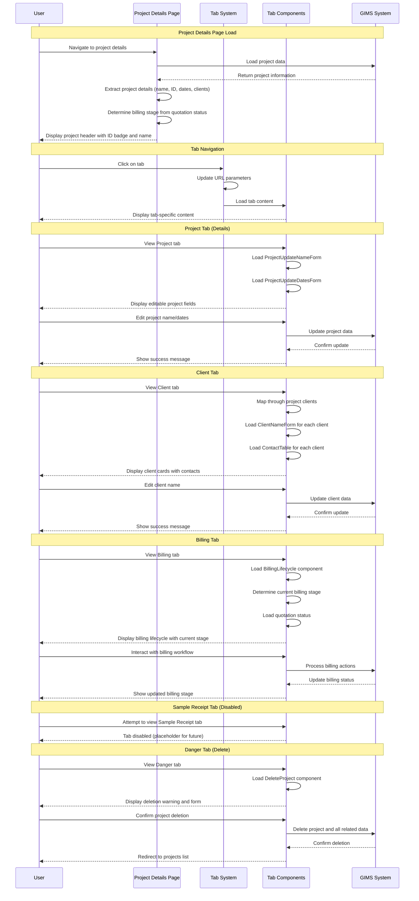

# GIMS Project Details Page Documentation

This document provides visual diagrams to help understand the project details page in the GIMS (Geotechnical Information Management System) and how it organizes project information across different tabs.

## Overview

The project details page is a comprehensive interface that allows users to view and manage all aspects of a project through a tabbed interface. It integrates project information, client management, billing lifecycle, and administrative functions in one unified view.

## Mermaid Sequence Diagram



## ASCII Flow Diagram

```
┌─────────────────────────────────────────────────────────────────────────────────┐
│                           GIMS PROJECT DETAILS PAGE                             │
└─────────────────────────────────────────────────────────────────────────────────┘

PAGE HEADER
┌─────────────────────────────────────────────────────────────────────────────────┐
│                                                                                 │
│ ┌─────────────────────────────────────────────────────────────────────────────┐ │
│ │ Navigation & Project Info                                                   │ │
│ │ ┌─────────────────────────────────────────────────────────────────────────┐ │ │
│ │ │ ← Go back to Projects List                                             │ │ │
│ │ │                                                                         │ │ │
│ │ │ [P2024-12345] ← Project ID Badge                                        │ │ │
│ │ │ Nakawa Power Lines ← Project Name (Large Heading)                      │ │ │
│ │ └─────────────────────────────────────────────────────────────────────────┘ │ │
│ └─────────────────────────────────────────────────────────────────────────────┘ │
└─────────────────────────────────────────────────────────────────────────────────┘
                                ↓
TAB NAVIGATION SYSTEM
┌─────────────────────────────────────────────────────────────────────────────────┐
│                                                                                 │
│ ┌─────────────────────────────────────────────────────────────────────────────┐ │
│ │ Tab Navigation Bar                                                           │ │ │
│ │ ┌─────────────────────────────────────────────────────────────────────────┐ │ │
│ │ │ [Project] [Client] [Billing] [Sample Receipt] [🗑️]                      │ │ │
│ │ │    ↑        ↑        ↑         ↑ (disabled)    ↑                       │ │ │
│ │ │  Active   Click   Click      Future         Danger                      │ │ │
│ │ │   Tab     to      to        Feature        Zone                         │ │ │
│ │ │          Switch  Switch                                                   │ │ │
│ │ └─────────────────────────────────────────────────────────────────────────┘ │ │
│ └─────────────────────────────────────────────────────────────────────────────┘ │
└─────────────────────────────────────────────────────────────────────────────────┘
                                ↓
TAB CONTENT AREAS
┌─────────────────────────────────────────────────────────────────────────────────┐
│                                                                                 │
│ TAB 1: PROJECT DETAILS                                                          │
│ ┌─────────────────────────────────────────────────────────────────────────────┐ │
│ │ Project Information Management                                              │ │ │
│ │ ┌─────────────────────────────────────────────────────────────────────────┐ │ │
│ │ │ Project Name Form                                                      │ │ │
│ │ │ ┌─────────────────────────────────────────────────────────────────────┐ │ │ │
│ │ │ │ Title: "Project Name"                                             │ │ │ │
│ │ │ │ Description: "Used to identify a project in the system"          │ │ │ │
│ │ │ │ Field: [Editable Input Field] ← Current project name              │ │ │ │
│ │ │ │ Action: [Save Button] ← Updates project name                      │ │ │ │
│ │ │ └─────────────────────────────────────────────────────────────────────┘ │ │ │
│ │ └─────────────────────────────────────────────────────────────────────────┘ │ │
│ │                                                                             │ │
│ │ ┌─────────────────────────────────────────────────────────────────────────┐ │ │
│ │ │ Project Dates Form                                                     │ │ │
│ │ │ ┌─────────────────────────────────────────────────────────────────────┐ │ │ │
│ │ │ │ Title: "Expected start and end date"                               │ │ │ │
│ │ │ │ Description: "Used to track progression and milestones"           │ │ │ │
│ │ │ │ Start Date: [Calendar Picker] ← Current start date                │ │ │ │
│ │ │ │ End Date: [Calendar Picker] ← Current end date                   │ │ │ │
│ │ │ │ Action: [Save Button] ← Updates project dates                     │ │ │ │
│ │ │ └─────────────────────────────────────────────────────────────────────┘ │ │ │
│ │ └─────────────────────────────────────────────────────────────────────────┘ │ │
│ └─────────────────────────────────────────────────────────────────────────────┘ │
└─────────────────────────────────────────────────────────────────────────────────┘
                                ↓
TAB 2: CLIENT MANAGEMENT
┌─────────────────────────────────────────────────────────────────────────────────┐
│                                                                                 │
│ ┌─────────────────────────────────────────────────────────────────────────────┐ │
│ │ Client Information & Contact Management                                      │ │ │
│ │ ┌─────────────────────────────────────────────────────────────────────────┐ │ │
│ │ │ Client Card 1                                                           │ │ │
│ │ │ ┌─────────────────────────────────────────────────────────────────────┐ │ │ │
│ │ │ │ [1] Client Name ← Client number badge                              │ │ │ │
│ │ │ │                                                                     │ │ │ │
│ │ │ │ Client Name Form                                                    │ │ │ │
│ │ │ │ ┌─────────────────────────────────────────────────────────────────┐ │ │ │ │
│ │ │ │ │ Title: "Client Name"                                             │ │ │ │ │
│ │ │ │ │ Field: [Editable Input] ← Current client name                    │ │ │ │ │
│ │ │ │ │ Action: [Save Button] ← Updates client name                     │ │ │ │ │
│ │ │ │ └─────────────────────────────────────────────────────────────────┘ │ │ │ │
│ │ │ │                                                                     │ │ │ │
│ │ │ │ Contact Persons Table                                               │ │ │ │
│ │ │ │ ┌─────────────────────────────────────────────────────────────────┐ │ │ │ │
│ │ │ │ │ Name | Email | Phone | Role | Actions                          │ │ │ │ │
│ │ │ │ │ John | john@ | +123 | PM   | [Edit] [Remove]                   │ │ │ │ │
│ │ │ │ │ Jane | jane@ | +456 | Dev  | [Edit] [Remove]                   │ │ │ │ │
│ │ │ │ │ [Add Contact Button]                                            │ │ │ │ │
│ │ │ │ └─────────────────────────────────────────────────────────────────┘ │ │ │ │
│ │ │ └─────────────────────────────────────────────────────────────────────┘ │ │ │
│ │ └─────────────────────────────────────────────────────────────────────────┘ │ │
│ │                                                                             │ │
│ │ ┌─────────────────────────────────────────────────────────────────────────┐ │ │
│ │ │ Client Card 2 (if multiple clients)                                     │ │ │
│ │ │ ┌─────────────────────────────────────────────────────────────────────┐ │ │ │
│ │ │ │ [2] Another Client Name                                            │ │ │ │
│ │ │ │ [Dropdown Menu] ← Remove client option (if multiple clients)       │ │ │ │
│ │ │ │ ... (same structure as Client Card 1)                               │ │ │ │
│ │ │ └─────────────────────────────────────────────────────────────────────┘ │ │ │
│ │ └─────────────────────────────────────────────────────────────────────────┘ │ │
│ └─────────────────────────────────────────────────────────────────────────────┘ │
└─────────────────────────────────────────────────────────────────────────────────┘
                                ↓
TAB 3: BILLING LIFECYCLE
┌─────────────────────────────────────────────────────────────────────────────────┐
│                                                                                 │
│ ┌─────────────────────────────────────────────────────────────────────────────┐ │
│ │ Billing Workflow Integration                                               │ │ │
│ │ ┌─────────────────────────────────────────────────────────────────────────┐ │ │
│ │ │ Billing Lifecycle Component                                            │ │ │
│ │ │ ┌─────────────────────────────────────────────────────────────────────┐ │ │ │
│ │ │ │ Stage 1: Quotation Preparation ← Current stage indicator          │ │ │ │
│ │ │ │ Stage 2: Quotation Sent                                           │ │ │ │
│ │ │ │ Stage 3: Client Feedback                                           │ │ │ │
│ │ │ │ Stage 4: Invoice Generated                                         │ │ │ │
│ │ │ │ Stage 5: Payment Processing                                        │ │ │ │
│ │ │ │                                                                     │ │ │ │
│ │ │ │ Interactive Elements:                                               │ │ │ │
│ │ │ │ • Create Quotation Button (if no quotation)                        │ │ │ │
│ │ │ │ • Send Quotation Button (if draft)                                 │ │ │ │
│ │ │ │ • View/Download Quotation (if sent)                                │ │ │ │
│ │ │ │ • Respond to Quotation (client role)                                │ │ │ │
│ │ │ │ • Make Payment (if invoiced)                                       │ │ │ │
│ │ │ │ • View Payments (if payments exist)                                │ │ │ │
│ │ │ └─────────────────────────────────────────────────────────────────────┘ │ │ │
│ │ └─────────────────────────────────────────────────────────────────────────┘ │ │
│ │                                                                             │ │
│ │ ┌─────────────────────────────────────────────────────────────────────────┐ │ │
│ │ │ Quotation File Component (if quotation exists)                         │ │ │
│ │ │ ┌─────────────────────────────────────────────────────────────────────┐ │ │ │
│ │ │ │ Quotation Document Display                                          │ │ │ │
│ │ │ │ • File preview/thumbnail                                           │ │ │ │
│ │ │ │ • Download button                                                   │ │ │ │
│ │ │ │ • File information (size, type, date)                              │ │ │ │
│ │ │ └─────────────────────────────────────────────────────────────────────┘ │ │ │
│ │ └─────────────────────────────────────────────────────────────────────────┘ │ │
│ └─────────────────────────────────────────────────────────────────────────────┘ │
└─────────────────────────────────────────────────────────────────────────────────┘
                                ↓
TAB 4: SAMPLE RECEIPT (DISABLED)
┌─────────────────────────────────────────────────────────────────────────────────┐
│                                                                                 │
│ ┌─────────────────────────────────────────────────────────────────────────────┐ │
│ │ Future Feature - Currently Disabled                                         │ │ │
│ │ ┌─────────────────────────────────────────────────────────────────────────┐ │ │
│ │ │ Sample Receipt Verification Component                                   │ │ │
│ │ │ ┌─────────────────────────────────────────────────────────────────────┐ │ │ │
│ │ │ │ [Placeholder for future sample receipt functionality]               │ │ │ │
│ │ │ │ • Sample tracking                                                   │ │ │ │
│ │ │ │ • Receipt verification                                              │ │ │ │
│ │ │ │ • Quality control                                                    │ │ │ │
│ │ │ └─────────────────────────────────────────────────────────────────────┘ │ │ │
│ │ └─────────────────────────────────────────────────────────────────────────┘ │ │
│ └─────────────────────────────────────────────────────────────────────────────┘ │
└─────────────────────────────────────────────────────────────────────────────────┘
                                ↓
TAB 5: DANGER ZONE (DELETE)
┌─────────────────────────────────────────────────────────────────────────────────┐
│                                                                                 │
│ ┌─────────────────────────────────────────────────────────────────────────────┐ │
│ │ Project Deletion Management                                                │ │ │
│ │ ┌─────────────────────────────────────────────────────────────────────────┐ │ │
│ │ │ Delete Project Warning                                                  │ │ │
│ │ │ ┌─────────────────────────────────────────────────────────────────────┐ │ │ │
│ │ │ │ ⚠️  DANGER ZONE                                                      │ │ │ │
│ │ │ │                                                                     │ │ │ │
│ │ │ │ Title: "Delete Project"                                             │ │ │ │
│ │ │ │ Description: "This project will be deleted, along with all of its  │ │ │ │
│ │ │ │ Data, Files, Invoices and Quotations. This action is irreversible  │ │ │ │
│ │ │ │ and can not be undone."                                             │ │ │ │
│ │ │ │                                                                     │ │ │ │
│ │ │ │ Confirmation: [Delete Project Button] ← Requires confirmation       │ │ │ │
│ │ │ └─────────────────────────────────────────────────────────────────────┘ │ │ │
│ │ └─────────────────────────────────────────────────────────────────────────┘ │ │
│ └─────────────────────────────────────────────────────────────────────────────┘ │
└─────────────────────────────────────────────────────────────────────────────────┘

BILLING STAGE DETERMINATION LOGIC:
┌─────────────────────────────────────────────────────────────────────────────────┐
│                                                                                 │
│ Quotation Status → Billing Stage Mapping:                                      │
│ ┌─────────────────────────────────────────────────────────────────────────────┐ │
│ │ • draft → Stage 1 (Quotation Preparation)                                  │ │
│ │ • sent → Stage 2 (Quotation Sent)                                          │ │
│ │ • accepted → Stage 3 (Client Feedback)                                      │ │
│ │ • rejected → Stage 3 (Client Feedback) + Rejection Stage                   │ │
│ │ • invoiced → Stage 4 (Invoice Generated)                                   │ │
│ │ • partially_paid → Stage 5 (Payment Processing)                           │ │
│ │ • fully_paid → Stage 5 (Payment Processing)                               │ │
│ │ • No quotation → Stage 1 (Quotation Preparation)                           │ │
│ └─────────────────────────────────────────────────────────────────────────────┘ │
└─────────────────────────────────────────────────────────────────────────────────┘

URL STATE MANAGEMENT:
┌─────────────────────────────────────────────────────────────────────────────────┐
│                                                                                 │
│ Tab Navigation Updates URL Parameters:                                         │
│ ┌─────────────────────────────────────────────────────────────────────────────┐ │
│ │ • Click "Project" tab → ?tab=details                                       │ │
│ │ • Click "Client" tab → ?tab=client                                         │ │
│ │ • Click "Billing" tab → ?tab=billing                                       │ │
│ │ • Click "Sample Receipt" tab → ?tab=sample-receipt                         │ │
│ │ • Click "Danger" tab → ?tab=danger                                         │ │
│ │                                                                             │ │
│ │ Page Load Reads URL Parameters:                                             │ │
│ │ • Check for ?tab= parameter                                                 │ │
│ │ • Set active tab based on URL parameter                                    │ │
│ │ • Default to "details" tab if no parameter                                 │ │
│ └─────────────────────────────────────────────────────────────────────────────┘ │
└─────────────────────────────────────────────────────────────────────────────────┘
```

## Key Features

### 1. **Tabbed Interface**

- **5 Main Tabs**: Project, Client, Billing, Sample Receipt, Danger
- **URL State Management**: Tab selection updates URL parameters
- **Persistent Navigation**: Tab state maintained across page refreshes

### 2. **Project Information Management**

- **Editable Fields**: Project name and date range can be updated
- **Real-time Updates**: Changes saved immediately with success feedback
- **Form Validation**: Client-side validation for all editable fields

### 3. **Client Management**

- **Multiple Clients**: Support for multiple clients per project
- **Client Cards**: Each client displayed in separate card with actions
- **Contact Management**: Full contact person management per client
- **Client Actions**: Edit names, add/remove contacts, remove clients

### 4. **Billing Integration**

- **Dynamic Stage Display**: Billing stage determined by quotation status
- **Interactive Workflow**: Full billing lifecycle integration
- **Role-Based Actions**: Different actions available based on user role
- **File Management**: Quotation file display and download

### 5. **Administrative Functions**

- **Project Deletion**: Secure deletion with warning and confirmation
- **Data Cleanup**: Deletes all related data (quotations, invoices, files)
- **Future Features**: Sample receipt tab prepared for future functionality

## Tab-Specific Functionality

### **Project Tab**

- Edit project name with validation
- Update project start and end dates
- Form-based editing with save actions

### **Client Tab**

- View all project clients in cards
- Edit client names individually
- Manage contact persons per client
- Add/remove contacts and clients

### **Billing Tab**

- Complete billing lifecycle visualization
- Interactive quotation creation and management
- Payment processing interface
- File download and management

### **Sample Receipt Tab**

- Currently disabled
- Placeholder for future sample management features

### **Danger Tab**

- Project deletion interface
- Warning messages and confirmation
- Irreversible action with data cleanup

This visual documentation should help users understand the comprehensive project details interface and how to navigate between different aspects of project management efficiently.
