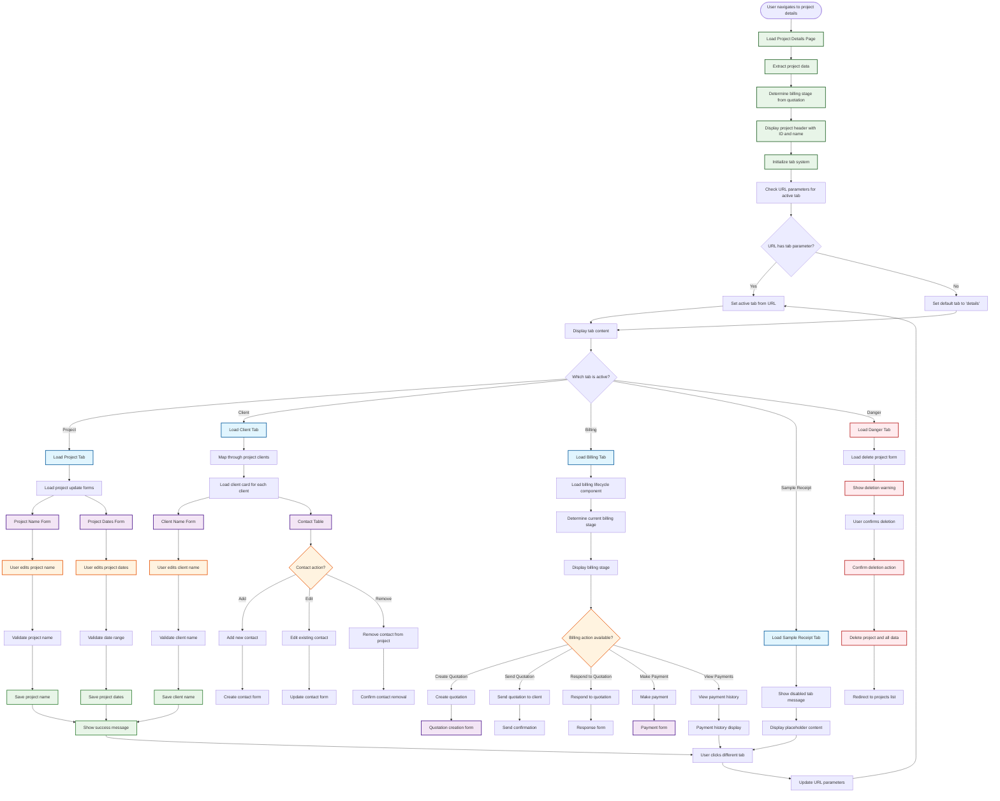
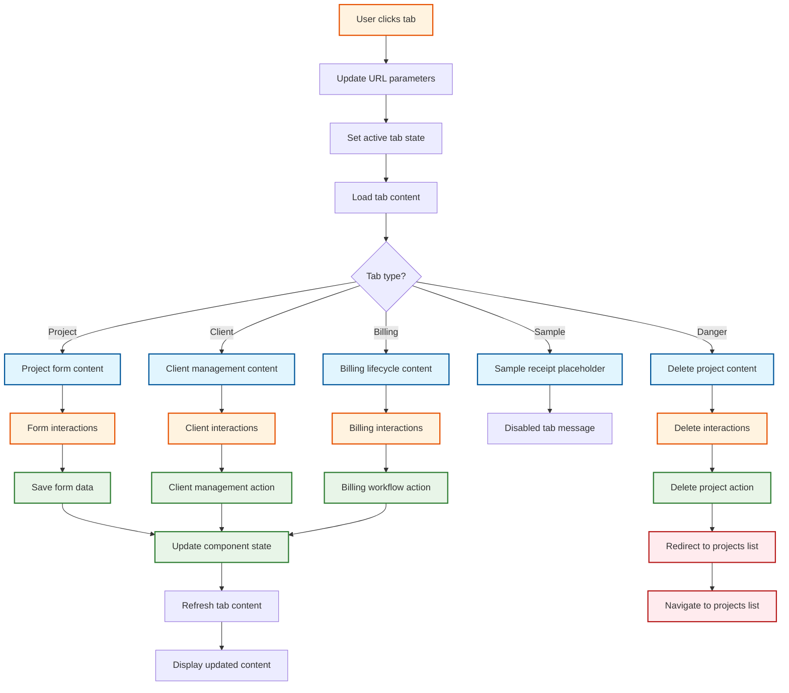
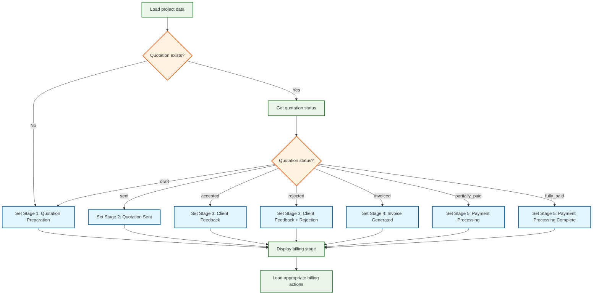

# GIMS Project Details - Detailed Flowchart

## Mermaid Flowchart Diagram

## Tab State Management Flowchart

## Billing Stage Determination Logic

## Key Decision Points

### 1. **Tab Navigation**

- **URL Parameter Check**: Determines initial active tab
- **Tab Click Handling**: Updates URL and loads appropriate content
- **State Persistence**: Tab selection maintained across page interactions

### 2. **Billing Stage Determination**

- **Quotation Existence**: Checks if project has associated quotation
- **Status Mapping**: Maps quotation status to billing stage
- **Rejection Handling**: Special handling for rejected quotations

### 3. **Form Interactions**

- **Real-time Validation**: Client-side validation for all forms
- **Save Actions**: Immediate save with success feedback
- **State Updates**: Component state updated after successful saves

### 4. **Client Management**

- **Multiple Clients**: Handles projects with multiple clients
- **Contact Management**: Full CRUD operations for contacts
- **Client Actions**: Add, edit, remove clients and contacts

### 5. **Danger Zone**

- **Confirmation Required**: Multiple confirmation steps for deletion
- **Data Cleanup**: Ensures all related data is removed
- **Irreversible Action**: Clear warning about permanent deletion

## URL State Management

### **Tab Parameter Updates**

- Each tab click updates the URL with `?tab={tabName}`
- Page refresh maintains the active tab
- Default tab is "details" if no parameter specified

### **Tab Names**

- `details` → Project tab
- `client` → Client tab
- `billing` → Billing tab
- `sample-receipt` → Sample Receipt tab
- `danger` → Danger tab

This detailed flowchart shows all the decision points, state management, and user interactions in the project details page, making it easier for users to understand how to navigate and use the interface effectively.
