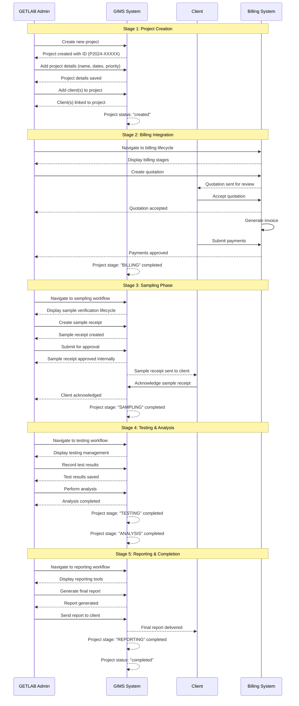

# GIMS Project Lifecycle Documentation

This document provides visual diagrams to help understand the project lifecycle process in the GIMS (Geotechnical Information Management System).

## Overview

The project lifecycle consists of 5 main stages that guide projects from creation to completion. The system handles project creation, billing integration, sampling, testing, analysis, and reporting phases.

## Mermaid Sequence Diagram



## ASCII Flow Diagram

```
┌─────────────────────────────────────────────────────────────────────────────────┐
│                           GIMS PROJECT LIFECYCLE                                 │
└─────────────────────────────────────────────────────────────────────────────────┘

STAGE 1: PROJECT CREATION
┌─────────────────────────────────────────────────────────────────────────────────┐
│ GETLAB Admin creates new project                                               │
│ ↓                                                                               │
│ System auto-generates Project ID (P2024-XXXXX)                                 │
│ ↓                                                                               │
│ Admin adds project details (name, dates, priority)                             │
│ ↓                                                                               │
│ Admin adds client(s) to project                                                │
│ ↓                                                                               │
│ System links client(s) to project                                              │
│ ↓                                                                               │
│ Status: "created"                                                               │
└─────────────────────────────────────────────────────────────────────────────────┘
                                ↓
STAGE 2: BILLING INTEGRATION
┌─────────────────────────────────────────────────────────────────────────────────┐
│ Admin navigates to billing lifecycle                                           │
│ ↓                                                                               │
│ Admin creates quotation                                                         │
│ ↓                                                                               │
│ Client reviews and accepts quotation                                           │
│ ↓                                                                               │
│ System generates invoice                                                        │
│ ↓                                                                               │
│ Client submits payments                                                         │
│ ↓                                                                               │
│ Admin approves payments                                                          │
│ ↓                                                                               │
│ Stage: "BILLING" completed                                                      │
└─────────────────────────────────────────────────────────────────────────────────┘
                                ↓
STAGE 3: SAMPLING PHASE
┌─────────────────────────────────────────────────────────────────────────────────┐
│ Admin navigates to sampling workflow                                          │
│ ↓                                                                               │
│ Admin creates sample receipt                                                    │
│ ↓                                                                               │
│ Admin submits sample receipt for approval                                      │
│ ↓                                                                               │
│ Admin approves sample receipt internally                                        │
│ ↓                                                                               │
│ System sends sample receipt to client                                          │
│ ↓                                                                               │
│ Client acknowledges sample receipt                                              │
│ ↓                                                                               │
│ Stage: "SAMPLING" completed                                                     │
└─────────────────────────────────────────────────────────────────────────────────┘
                                ↓
STAGE 4: TESTING & ANALYSIS
┌─────────────────────────────────────────────────────────────────────────────────┐
│ Admin navigates to testing workflow                                            │
│ ↓                                                                               │
│ Admin records test results                                                      │
│ ↓                                                                               │
│ Admin performs analysis                                                         │
│ ↓                                                                               │
│ System processes test data and analysis                                        │
│ ↓                                                                               │
│ Stage: "TESTING" completed                                                      │
│ ↓                                                                               │
│ Stage: "ANALYSIS" completed                                                     │
└─────────────────────────────────────────────────────────────────────────────────┘
                                ↓
STAGE 5: REPORTING & COMPLETION
┌─────────────────────────────────────────────────────────────────────────────────┐
│ Admin navigates to reporting workflow                                          │
│ ↓                                                                               │
│ Admin generates final report                                                    │
│ ↓                                                                               │
│ Admin sends report to client                                                    │
│ ↓                                                                               │
│ Client receives final report                                                   │
│ ↓                                                                               │
│ Stage: "REPORTING" completed                                                    │
│ ↓                                                                               │
│ Status: "completed"                                                             │
└─────────────────────────────────────────────────────────────────────────────────┘

PROJECT STAGES:
┌─────────────────────────────────────────────────────────────────────────────────┐
│ • BILLING: Quotation creation, client acceptance, payment processing            │
│ • SAMPLING: Sample receipt creation, approval, client acknowledgment           │
│ • TESTING: Test execution and result recording                                 │
│ • ANALYSIS: Data analysis and interpretation                                   │
│ • REPORTING: Final report generation and delivery                             │
└─────────────────────────────────────────────────────────────────────────────────┘

PROJECT STATUSES:
┌─────────────────────────────────────────────────────────────────────────────────┐
│ • created: Project created with basic details                                   │
│ • active: Project in progress (any stage)                                      │
│ • completed: All stages completed successfully                                 │
│ • on_hold: Project temporarily paused                                           │
│ • cancelled: Project cancelled before completion                               │
└─────────────────────────────────────────────────────────────────────────────────┘
```

## Key Features

### 1. **Stage-Based Progression**

- **Sequential Stages**: Projects progress through 5 main stages
- **Stage Completion**: Each stage must be completed before moving to the next
- **Progress Tracking**: Visual indicators show current stage and completion status

### 2. **Role-Based Access**

- **GETLAB Admins**: Can create projects, manage all stages, approve workflows
- **Clients**: Can review quotations, acknowledge sample receipts, receive reports

### 3. **Integration Points**

- **Billing Integration**: Seamless transition from project creation to billing
- **Sample Verification**: Integrated sampling workflow with approval process
- **Document Management**: PDF generation and client delivery

### 4. **Workflow Management**

- **Approval Workflows**: Internal approval processes for critical stages
- **Client Communication**: Automated notifications and document delivery
- **Status Tracking**: Real-time status updates across all stages

### 5. **Data Management**

- **Project Records**: Centralized project information storage
- **Client Linking**: Multiple clients can be associated with one project
- **Document Generation**: Automated PDF generation for reports and receipts

## Common Scenarios

### Scenario 1: Standard Project Flow

1. Admin creates project → adds client details
2. Admin creates quotation → client accepts
3. Admin processes payments → billing completed
4. Admin creates sample receipt → client acknowledges
5. Admin records tests → performs analysis
6. Admin generates report → sends to client
7. Project completed

### Scenario 2: Multi-Client Project

1. Admin creates project → adds multiple clients
2. Admin creates quotation for each client
3. Each client accepts their respective quotation
4. Admin processes payments from all clients
5. Continue with sampling, testing, analysis, reporting
6. Project completed with all clients satisfied

### Scenario 3: Project Modification

1. Admin creates project → adds initial details
2. Admin modifies project details as needed
3. Admin adds additional clients during project
4. Continue with standard workflow
5. Project completed with updated information

This visual documentation focuses on the main project lifecycle steps without over-emphasizing form validations, providing a clear understanding of the overall process flow.
